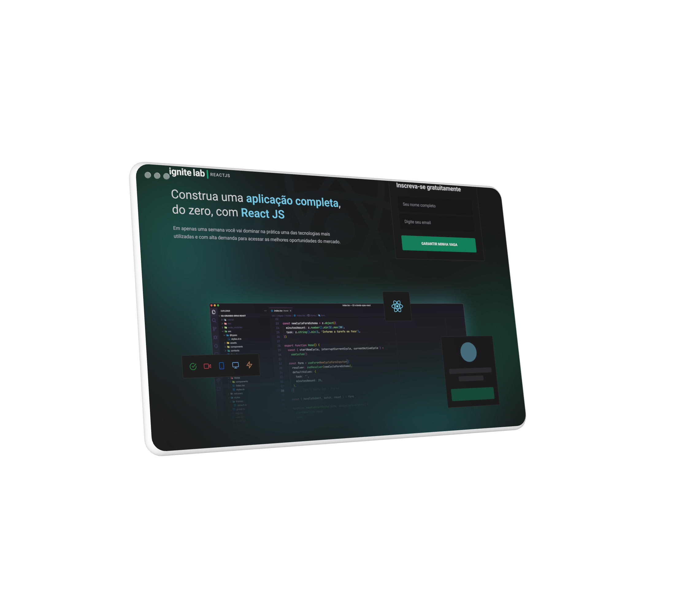

<div align="center">

</div>
<br />

## 🛠 Get Started

- Install project dependencies:

```ts
  yarn install or npm install
```

- Start the application:

```ts
  yarn dev
```

## 🛠 Skills

![react][react] ![graphql][graphql] ![apollo client][apollo] ![sass][sass] ![tailwind css][tailwind] ![vite][vite]

## 💾 Environment Variables

To run this project, you will need to add the following environment variables to your `.env` file:

- **`VITE_API_URL`:** **GraphCMS** API Link (used on **Apollo Client**)
- **`VITE_API_ACCESS_TOKEN`:** **GraphCMS** Token (used on **Apollo Client** to)

## 🌐 Live Version

[](https://event-plataform-tawny.vercel.app/)

## 🔗 More About Me

[](https://www.linkedin.com/in/rodrigo-si/)
[](https://www.instagram.com/rodrigo_dev_front/)

[react]: https://img.shields.io/badge/react-00875F?style=for-the-badge&logo=react&logoColor=white
[graphql]: https://img.shields.io/badge/graphql-00875F?style=for-the-badge&logo=graphql&logoColor=white
[apollo]: https://img.shields.io/badge/apollo%20client-00875F?style=for-the-badge&logo=apollographql&logoColor=white
[sass]: https://img.shields.io/badge/sass-00875F?style=for-the-badge&logo=sass&logoColor=white
[tailwind]: https://img.shields.io/badge/tailwind%20css-00875F?style=for-the-badge&logo=tailwindcss&logoColor=white
[vite]: https://img.shields.io/badge/vite-00875F?style=for-the-badge&logo=vite&logoColor=white
